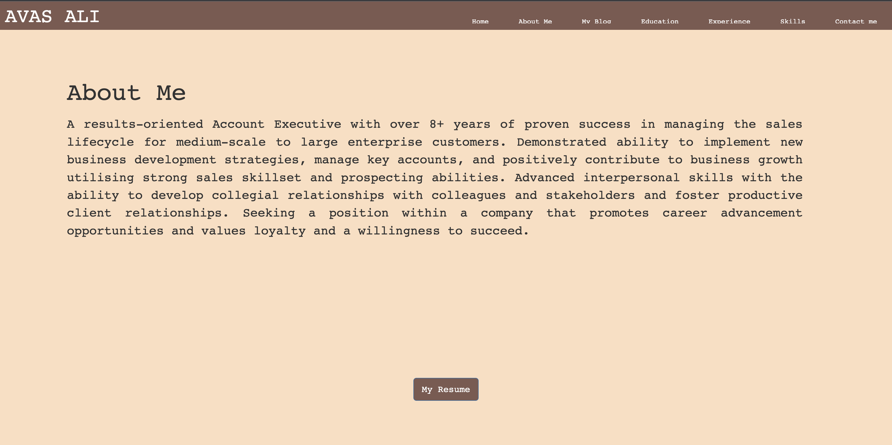

# AvasMohammadAli_T1A2
# My Portfolio Website

This is my personal portfolio website that showcases my projects and skills.

## Features

- Responsive design for optimal viewing on different devices
- About section introducing myself and my background
- Education section which mentions about my qualification
- Experience section which mentions about my experience
- My Blog section which talks about my blogging on latest trends on machine learning
- Skills section which talks about my various technical skills
- Contact section with a contact form for visitors to reach out to me

## Technologies Used

- HTML5
- CSS3
- Bootstrap

## Video Presentaion link
`https://us06web.zoom.us/rec/share/mvmkfLLSIEUMJSSnlcxhfP6JjtahWPYkTag2SlzYwDZKhDi_eAZU6a6jrAY037od.GGqR-gS9BmYXQZou`

Passcode: l31%eu05

## Getting Started

1. Clone this repository: `git clone https://github.com/avasa86/AvasMohammadAli_T1A2.git`
2. Navigate to the project directory: `cd src`
3. Open `index.html` in your preferred web browser.

## Usage

Feel free to customize this website according to your needs. You can update the content, add new projects, or modify the styling.

The main files you may want to edit are:
- `index.html`: Update the content and structure of the website.
- `aboutme.html`: Update the content and structute of the website.
- `education.html`: Update the content and structute of the website.
- `experience.html`: Update the content and structute of the website.
- `blog.html`: Update the content and structute of the website.
- `contactme.html`: Update the content and structute of the website.
- `css/styles.css`: Modify the styling, colors, and layout.

## Sitemap

## Screenshots

![Responsive ]
